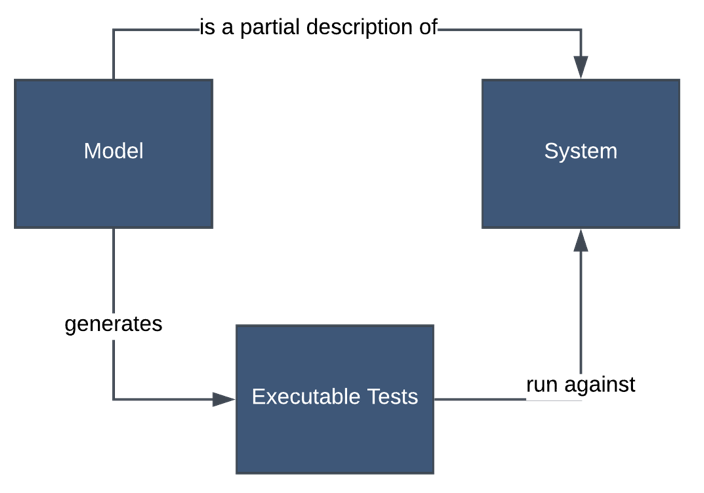
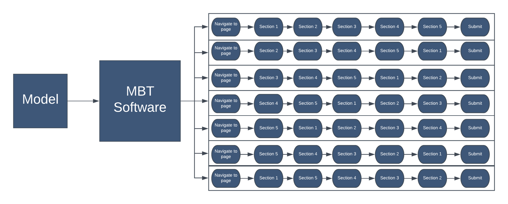
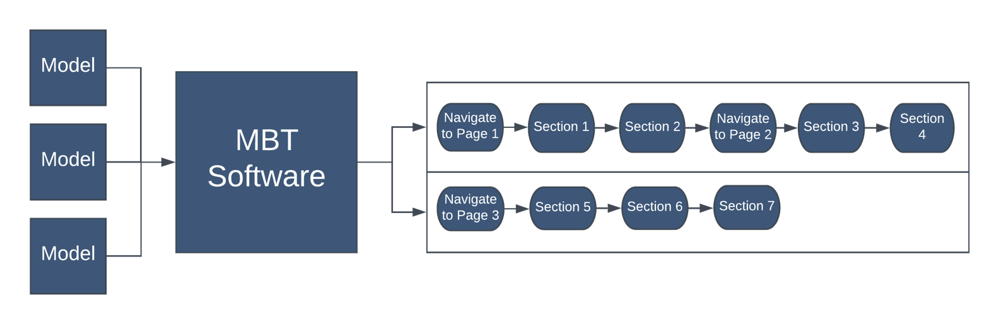

## Definition
* Describing system requirements and behavior as a model​
* Generating tests from the those models​

## Benefits vs Costs

### Benefits
  * Software behavior specified once
  * Lower maintenance
  * Very high coverage
  * Independent of system implementation

### Costs
  * Steep learning curve
  * More up front effort

## Use Cases
  * Can generate many tests paths from models for high test coverage

  * Can generate optimized path from models for minimum cost and maximum coverage

## Model Based Testing References
 * [The challenges and benefits of model based testing](https://saucelabs.com/blog/the-challenges-and-benefits-of-model-based-testing)
 * [Model based testing at Microsoft](https://msdn.microsoft.com/en-us/library/ee620469.aspx)
 * [A comprehensive framework for testing graphical user interfaces](https://www.cs.umd.edu/~atif/papers/MemonPHD2001.pdf)
 * [Coverage criteria for GUI testing](https://www.cs.umd.edu/~atif/papers/MemonFSE2001.pdf)
  