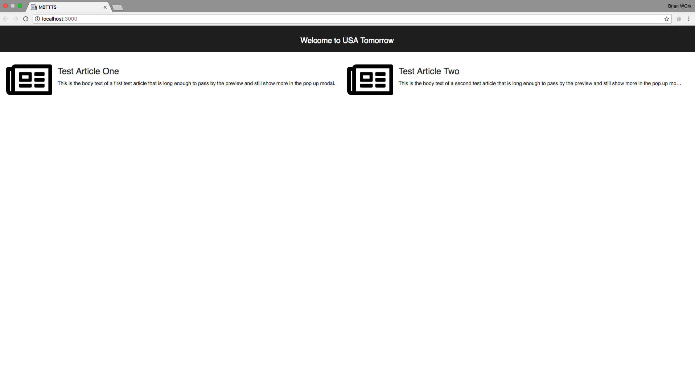
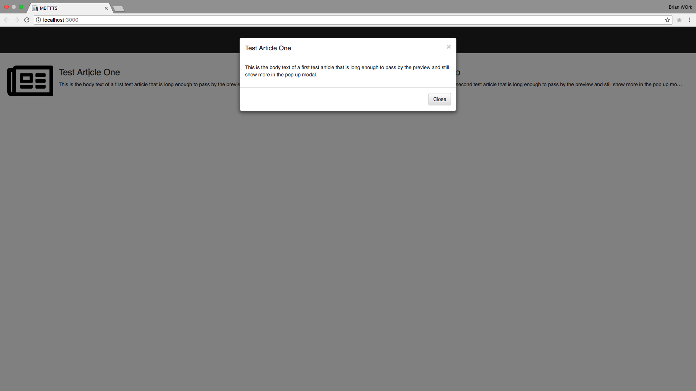

Simulato is a model based testing tool to help provide full and variable coverage to different test paths in a given UI. While designed with a particular internal tool in mind, simulato is usable currently with any UI that follows regular javascript/HTML paradigms. In order to familiarize yourself with simulato, there are a couple of concepts you may want to understand first:

* Basic Javascript 
* JSON format
* Understanding of the DOM structure and HTML Elements (We use chrome devtools to investigate the DOM)
* A high level overview of system you will be modeling
* [Selenium Webdriver](https://www.seleniumhq.org/docs/03_webdriver.jsp)
* [Chai Assertions](http://www.chaijs.com/api/assert/)

# Prerequisites
* Node.js version 8+
	* Download here: https://nodejs.org/en/
* Chrome Browser installed
* Chromedriver installed
	* Download here: https://sites.google.com/a/chromium.org/chromedriver/downloads
* Code editor
	* Visual Studio Code: https://code.visualstudio.com/
	* Atom: https://atom.io/

# Process of Simulato
To make use of the tool, you will need to build out a suite of components to reflect your system under test. A component is a singular piece of the system you are describing in your test suite. For example, we have a basic webpage that has news articles:



For any given state there are many different things that we can test. 
In this "base state" of a homepage, we could test:
* The title banner appeared
* Each article appeared
* The Icons for each article appeared
* Each article has body text
* Each article is clickable
* And much more!

We do not need to specify every possible action and component of a given system.
We can simplify this system into a few basic components isolating the actions and arrangement of elements on the page within a component.

# Pieces of a Simulato Component
All of the components are states of a given piece of the system. In this case, we may define some components such as, news articles, homepage, and article modal. We could also make more specific components such as news article text body, but the idea of model based testing is to leave up the structure of the system to the user testing it. The more specific you get, technically the better, but when considering business needs and time required, what you gain from being more specific can be lost in time spent.
 
 [Details on Components can be found here](components.md)

# Setting up your workspace

Create a directory for your project. Within, include the directories 'tests' and 'components'. Also include the following package.json:

```js
{
  "name": "simulato-lab-tests",
  "version": "0.1.0",
  "description": "set of tests for simulato lab",
  "scripts": {
    "generate-tests": "sim generate",
    "run-tests": "sim run -p 5"
  },
  "author": "",
  "license": "ISC",
  "dependencies": {
    "simulato": "*"
  }
}
```

You will also need a file named simulato-config.js with the following:

```js
'use strict';

module.exports = {
  testPath: 'tests',
  components: 'components',
  outputPath: 'tests',
  technique: 'actionFocused',
};
```


Once created your directory should look like this:

  simulato-config.js
  package.json
  - tests
  - components
    navigate-to-test-site.js
    main-site-layout.js
    view-story-modal.js

Once your directory is set up type `npm install` and your initial set up should be complete!

Clone the repo [here](https://github.com/GannettDigital/simulato-test-site) and follow the directions to get the test site up and running as this is what you will be modeling against!


# Creating a component

While components are individual pieces of a system, it helps to break down the full system into the components you will need before you start creating any one component.

In the system described above, our actions might be to navigate to the website, click on an article, and close the article. In order to perform these actions, we will need a component to cover navigation. We will also need a component to represent the landing page, as well as a component for structures we care about on the landing page (news articles). Finally, we will need a modal representation for the news article:



Now that we have our list of components
* navigation
* landing page
* modal

Let's get started with navigation.

## Navigation

A part of running the tests is arriving at our desired location. As we are using selenium to control our browser, we will need to first make use of the driver to get there. Fortunately, a navigation component is very simple as it doesn't have to deal with the elements or the models of the component and only needs to interact with the actions piece.

Let us go through it piece by piece, and include the following in navigate-to-test-site.js:
```js
'use strict';

module.exports = {
  type: 'NavigateToTestSite',
  entryComponent: {
    name: 'navigateToTestSite',
    state: {}
  },
  elements(){
    return [];
  },
  model(){
    return {};
  },
  actions(){
    //below
  }
}
```

The first thing in our component is the type, the type is the component name, it is how the object of the component will be referenced. Below is the entry component, an entry component is essentially a starting point for the test path. This entry component in particular contains the name of the component and its current state, which is empty, for now think of the state as the current values occupying the model.

As we have no elements on a navigation, we simply return an empty array. Other components will contain elements which will be covered later.

Likewise because there are no elements, our model does not have any state to display, so there are no values (this is why our state in the entry component is blank).

Finally let's explore the actions below, include the following in your actions of 'navigate-to-test-site.js':

```js
return {
  NAVIGATE_TO_TEST_SITE: {
    perform(callback) {
      driver.get(`http://localhost:3000`)
      .then(callback, callback);
    },
    effects(expectedState) {
      expectedState.clear();
      expectedState.createAndAddComponent({
        type: 'MainSiteLayout',
        name: 'mainSiteLayout',
        state: {
          displayed: true,
          newsArticleImage: {
            displayed: true,
          },
          newsArticleHeading: {
            displayed: true,
            text: 'Test Article One',
          },
          newsArticleText: {
            displayed: true,
            text: 'This is the body text of a first test article that is long enough to pass by the preview and still show more in the pop up modal.',
          },
        },
      });
    },
  },
};
```

The actions have multiple discernable parts, in this example we have a perform block and effects dedicated to the particular action. 

First we have the perform block, which takes the argument of a callback function and performs actions with the driver to interact with the UI we are testing. In this instance, we are navigating to our test site (which is localhost:3000 for the sake of this example, but could vary assuming your port configuration etc). As a reminder, this tutorial assumes a working knowledge of selenium, if you are unfamiliar, their documentation listed above covers how to interact with the webdriver. 

After performing actions, we then need to continue to build our "test path" by creating additional components to further build our tests. In this case we are clearing the expectedState in order to make sure there is nothing carrying over as our new state will be the page we are navigating to. You can read more about the expected state here: [Expected State](expected-state.md).

Once the expected state is cleared, we then proceed to create and add a new component MainSiteLayout, which is the next component will be creating. In big picture terms though, this is where the component is being added to the "test path" I mentioned above.

At this point we now have our test directed in this manner:

  Entry Component(NavigateToTestSite) -> MainSiteLayout

Because our system only has one entry component, all tests will start at the same point regardless of how many components we add, but having multiple entry components is a possibility.

## Main Site Layout

So now that we have added MainSiteLayout to our path, that is the next component we should work on. Above you might have noticed that the MainSiteLayout has a component name, and instance name, and a state passed in. As we have no yet defined those fields, you have some freedom in how you might proceed with your modeling. You could choose to finish out your navigation component and then list what you plan to include in your MainSiteLayout component, or finish up your MainSiteLayout and go back to complete the action in your navigation component. As you fill out your model suite more and more it will matter less as the components involved in your actions will already be completed.

In this tutorial we will proceed to your MainSiteLayout and build the model based on the state passed in navigation. Include the following in 'main-site-layout.js' in your components directory:

```js
'use strict';

module.exports = {
type: 'MainSiteLayout',
elements() {
  return [
    {
      name: 'headerRow',
      selector: {
        type: 'getElementById',
        value: 'siteHeader',
      },
    },
    {
      name: 'newsArticle1',
      selector: {
        type: 'getElementById',
        value: 'article1',
      },
    },
    {
      name: 'newsArticleImage1',
      selector: {
        type: 'getElementById',
        value: 'article1Image',
      },
    },
    {
      name: 'newsArticleHeading1',
      selector: {
        type: 'getElementById',
        value: 'article1Heading',
      },
    },
    {
      name: 'newsArticleText1',
      selector: {
        type: 'getElementById',
        value: 'article1Text',
      },
    },
  ];
},
```

Above are a list of elements that will be used by the model, we already have our state from our navigation action. Below is the arrangement of those elements into a model, include this in your 'main-site-layout.js':  
```js
model() {
  return {
    displayed: 'headerRow.isDisplayed',
    newsArticleImage: {
      displayed: 'newsArticleImage1.isDisplayed',
    },
    newsArticleHeading: {
      displayed: 'newsArticleHeading1.isDisplayed',
      text: 'newsArticleHeading1.innerText',
    },
    newsArticleText: {
      displayed: 'newsArticleText1.isDisplayed',
      text: 'newsArticleText1.innerText',
    },
  };
},
```
Finally we have our action and its pieces, include all these in 'main-site-layout.js' as well:
```js
  actions() {
    return {
      CLICK_TO_VIEW_STORY: {
```
Above is the action name, we use all caps with underscores, so just stick with this naming convention, you can name it whatever you want and if you have additional actions, you will name those as additional object properties on the javascript object you are returning as the actions.
```js
preconditions() {
  return [
    ['isTrue', `pageState.${this.name}.displayed`],
    ['isTrue', `pageState.${this.name}.newsArticleHeading.displayed`],
    ['isTrue', `pageState.${this.name}.newsArticleText.displayed`]
  ];
},
```
The preconditions are what must be true prior to executing the perform block of the actions, you do not need to validate everything on the pages as a part of the pre-conditions, but what you might want to validate are properties involved in the perform block or other page state features that might relate directly to your actions. For example, above we are checking that the page is displayed, as well as the news article text and heading, we could also do things like check the image and the text accompanying the article, but what is tested is at the discretion of the user.

```js
perform(callback) {
  driver.findElement(By.id('article1'))
  .click()
  .then(callback, callback);
},
```
Once the preconditions are met, you can execute your perform block, in this case we are simply making a selenium call, which finds the element by its ID, then clicks on the element. After which it resolves or rejects the promise. If any of this language sounds unfamiliar, you may want to revisit some of the above posted selenium documentation or take a look at
[promises documentation.](https://developer.mozilla.org/en-US/docs/Web/JavaScript/Reference/Global_Objects/Promise)
```js
effects(expectedState) {
```
The effects are going to be a little more split up, because there is a lot to go over. This first part is just passing in the expected state to the effects function which was covered earlier. 
```js
expectedState.stash();
```
Once you have the expected state, you're going to want to stash the expected state as we are not navigating away from the page, but rather adding a component on top of it. Stashing is similar to clearing the state, but if you plan to return to the previous state, it is better to hold onto it so re-navigating to the previous state only requires a pop as opposed to rebuilding the state from a cleared state. 
```js
expectedState.createAndAddComponent({
  type: 'ViewStoryModal',
  name: 'article1ViewModal',
```
Here we are creating and adding a component to the expectedState, as we did before with adding the mainSiteLayout, we will be adding the ViewStoryModal component, whcih as you might have guessed displays the storymodal. As this action is particular to article1, we will include it as the name of the view modal. The final thing we are sending is the state of the component we are adding, which is detailed below.
```js
state: {
  displayed: true,
  modalTitle: {
    displayed: true,
    text: 'Test Article One',
  },
  modalBodyText: {
    displayed: true,
    text: 'This is the body text of a first test article that is long enough to pass by the preview and still show more in the pop up modal.',
  },
  closeButton: {
    displayed: true,
  },
},
```

All of the pieces above in the state should look familiar as they were added the same way within the effects of the navigation component. They simply detail what to expect in the component being added. Below is something slightly different, the options are parameters of the component, this is useful when referencing parent values within a model that inherits certain properties from the parent, such as an ID appended to additional information. 
```js
            options: {
            newsArticleId: 'article1',
            },
          });
        },
      },
    };
  }
}
```


Our Structure is now:

  Entry Component(NavigateToTestSite) -> MainSiteLayout -> ViewStoryModal

## View Story Modal

The third component is up to you to create (labs aren't too helpful if they aren't interactive), but don't worry! Above in the state that is passed to the ViewStoryModal component, we already have the model outlined for you! This template will also be provided to help you fill out your ViewStoryModal component, include the following in 'view-story-modal.js':
```js
'use strict';

module.exports = {
  type: 'ViewStoryModal',
  elements() {
    return [];
  },
  model() {
    return {};
  },
  actions() {
    return {
      CLICK_CLOSE_BUTTON: {
        preconditions() {
          return [];
        },
        perform(callback) {
        },
        effects(expectedState) {
        },
      },
    };
  },
};
```
Once you have completed filling out the ViewStoryModal, you should be able to npm install, npm run generate-tests and npm run run-tests. Your tests should build and run and you have successfully completed your first step into model based testing!

## Complete Files

Below are the files for the components used, I do no recommend simply copying and pasting them as you will not fully understand what they are doing, but if you are stuck, feel free to use them for reference:

# navigate-to-test-site.js
```js
'use strict';

module.exports = {
  type: 'NavigateToTestSite',
  entryComponent: {
    name: 'navigateToTestSite',
    state: {}
  },
  elements(){
    return [];
  },
  model(){
    return {};
  },
  actions(){
    return {
      NAVIGATE_TO_TEST_SITE: {
        perform(callback) {
          driver.get(`http://localhost:3000`)
          .then(callback, callback);
        },
        effects(expectedState) {
          expectedState.clear();
          expectedState.createAndAddComponent({
            type: 'MainSiteLayout',
            name: 'mainSiteLayout',
            state: {
              displayed: true,
              newsArticleImage: {
                displayed: true,
              },
              newsArticleHeading: {
                displayed: true,
                text: 'Test Article One',
              },
              newsArticleText: {
                displayed: true,
                text: 'This is the body text of a first test article that is long enough to pass by the preview and still show more in the pop up modal.',
              },
            },
          });
        },
      },
    };
  }
}
```
# main-site-layout.js
```js
'use strict';

module.exports = {
  type: 'MainSiteLayout',
  elements() {
    return [
      {
        name: 'headerRow',
        selector: {
          type: 'getElementById',
          value: 'siteHeader',
        },
      },
      {
        name: 'newsArticle1',
        selector: {
          type: 'getElementById',
          value: 'article1',
        },
      },
      {
        name: 'newsArticleImage1',
        selector: {
          type: 'getElementById',
          value: 'article1Image',
        },
      },
      {
        name: 'newsArticleHeading1',
        selector: {
          type: 'getElementById',
          value: 'article1Heading',
        },
      },
      {
        name: 'newsArticleText1',
        selector: {
          type: 'getElementById',
          value: 'article1Text',
        },
      },
    ];
  },
  model() {
    return {
      displayed: 'headerRow.isDisplayed',
      newsArticleImage: {
        displayed: 'newsArticleImage1.isDisplayed',
      },
      newsArticleHeading: {
        displayed: 'newsArticleHeading1.isDisplayed',
        text: 'newsArticleHeading1.innerText',
      },
      newsArticleText: {
        displayed: 'newsArticleText1.isDisplayed',
        text: 'newsArticleText1.innerText',
      },
    };
  },
  actions() {
    return {
      CLICK_TO_VIEW_STORY: {
        preconditions() {
          return [
            ['isTrue', `pageState.${this.name}.displayed`],
            ['isTrue', `pageState.${this.name}.newsArticleHeading.displayed`],
            ['isTrue', `pageState.${this.name}.newsArticleText.displayed`]
          ];
        },
        perform(callback) {
          driver.findElement(By.id('article1'))
          .click()
          .then(callback, callback);
        },
        effects(expectedState) {
          expectedState.stash();
          expectedState.createAndAddComponent({
            type: 'ViewStoryModal',
            name: 'article1ViewModal',
            state: {
              displayed: true,
              modalTitle: {
                displayed: true,
                text: 'Test Article One',
              },
              modalBodyText: {
                displayed: true,
                text: 'This is the body text of a first test article that is long enough to pass by the preview and still show more in the pop up modal.',
              },
              closeButton: {
                displayed: true,
              },
            },
            options: {
              newsArticleId: 'article1',
            },
          });
        },
      };
    }
  }
};

```
# view-story-modal.js
```js
'use strict';

module.exports = {
  type: 'ViewStoryModal',
  elements() {
    return [
      {
        name: 'modalContent',
        selector: {
        type: 'querySelector',
        value: `#${this.options.newsArticleId}ViewModal > div > div`,
        },
      },
      {
        name: 'modalTitle',
        selector: {
        type: 'getElementById',
        value: `${this.options.newsArticleId}ModalTitle`,
        },
      },
      {
        name: 'modalBodyText',
        selector: {
        type: 'getElementById',
        value: `${this.options.newsArticleId}ModalBodyText`,
        },
      },
      {
        name: 'closeButton',
        selector: {
        type: 'getElementById',
        value: `${this.options.newsArticleId}ModalCloseButton`,
        },
      },
    ];
  },
  model() {
    return {
      displayed: 'modalContent.isDisplayed',
      modalTitle: {
        displayed: 'modalTitle.isDisplayed',
        text: 'modalTitle.innerText',
      },
      modalBodyText: {
        displayed: 'modalBodyText.isDisplayed',
        text: 'modalBodyText.innerText',
      },
      closeButton: {
        displayed: 'closeButton.isDisplayed',
      },
    };
  },
  actions() {
    return {
      CLICK_CLOSE_BUTTON: {
        preconditions() {
          return [
            ['isTrue', `pageState.${this.name}.closeButton.displayed`],
          ];
        },
        perform(callback) {
          driver.findElement(By.id(`${this.options.newsArticleId}ModalCloseButton`))
          .click()
          .then(callback, callback);
        },
        effects(expectedState) {
          expectedState.pop();
        },
      },
    };
  },
};
```
