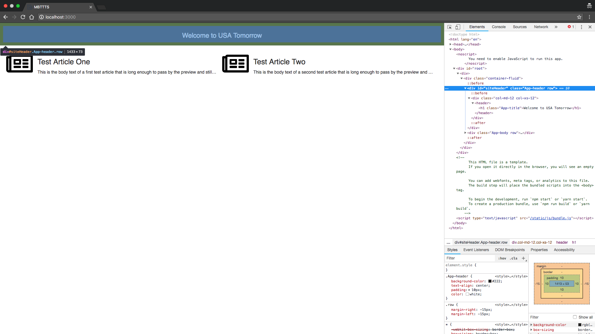

Now that we have our environment ready, as detailed in the [setup](/tutorial-setup), we can start creating components to model our system.  Usually, the first component created would be our entry component, a special type of component that describes how to enter the system. For the purpose of this tutorial we will start by creating our main site layout component, as this will help us learn the properties in a model.  After we will create the entry component that gets us there.

First, lets create the file in our system for our first component. This component will be modeling our 'mainSiteLayout.html' view, so let's create a file inside the components folder called 'mainSiteLayout.model.js'.

```
- components
    mainSiteLayout.model.js
- node_modules 
package-lock.json 
package.json
```

Each component we create is an object that is exported from a JavaScript file. We use Node's [modules system](https://nodejs.org/api/modules.html#modules_module_exports) to export our objects. When creating components we recommend using [strict mode](https://developer.mozilla.org/en-US/docs/Web/JavaScript/Reference/Strict_mode). Lets create the following basic shell for our component.

```
'use strict'

module.exports = {

}
```

Every component needs a unique `type` property. This can be thought of as similar to how you would name a class or constructor in an object oriented language.  Whenever we create and add a component we will add components of a specified `type` while providing a unique `name`.  Please note that just like classes or constructors, we want to use PascalCase so we can quickly differentiate `type` values from other properties' values such a `name`s.


```
'use strict'

module.exports = {
  type: 'MainSiteLayout'
}
```

The next property required for every component is the `elements` property. This is required to be a function that returns an array of objects specifying which select elements to select in the HTML.  Let's break this down some more to get a clear picture of what `elements` does for us.  As we are modeling out our system and creating components to represent various pieces of that system we need a way to tell Simulato what elements on the page we specifically care about. More specifically, `elements` is used to tell Simulato how to select them from the page.

Let's take a look at the page that's presented to us when we navigate to the test site.


For simplicity of our first component, let's use the header as an element that we care about on the page. We need to create an object inside the returned elements array that tells Simulato how to find that header on the page.  We always suggest using ids whenever possible, and if you have access to the html, add ids when needed.  Lets inspect the html using [Chrome developer tools](https://developers.google.com/web/tools/chrome-devtools/).



Looking at the div element that is used to contain our header, it has the id of `siteHeader`.  We can now use this information to create the elements section of our component.

```
'use strict'

module.exports = {
  type: 'MainSiteLayout',
  elements () {
    return [
      {
        name: 'siteHeader',
        selector: {
          type: 'getElementById',
          value: 'siteHeader'
        }
      }
    ];
  },
}
```

When creating element objects, each must have a unique `name`. In addition, it needs a `selector` object that contains both `type` and `value`. The `selector.type` property will tell Simulato what browser selector function to run. `selector.value` will tell Simulato what value to run the selector function with. The current supported selectors can be found in the [elements section](/components/#elements) of the components documentation.  When we looked at the page there was more going on that just a header, but for creating our first component we will just worry about the header for now.  As the tutorial progresses, we will flesh out each component we create to make a full model of our system. Behind the scenes, Simulato converts our returned 'elements' into a single object. Each property on the object is the 'name' of an element, with its value an object containing the properties: `name`, `isDisplayed`, `disabled`, `innerHTML`, `innerText`, `hidden`, `value`, `checked`, `attributes`, `disabled`, and `webElement`.  More information regarding these properties can be found in the [elements section](/components/#elements) of the components documentation.  These properties are used in the `model` section which we'll look at next.

The `model` is a required section of the component which is a function that returns an object.  If the `elements` section can be thought of as how we tell Simulato where to get the `elements`, the `model` can be thought of as what things we care about for those elements.  When an element is created in the `elements` section, Simulato will go and get information about the properties of those elements as stated above. It's this information we use to model out the state of our system.

For our `MainSiteLayout` component we added the 'siteHeader' element, now lets create the model section. Remember, this will detail what about the 'siteHeader' we care about. For right now, we simply care about it being displayed.

```
'use strict'

module.exports = {
  type: 'MainSiteLayout',
  elements () {
    return [
      {
        name: 'siteHeader',
        selector: {
          type: 'getElementById',
          value: 'siteHeader'
        }
      }
    ];
  },
  model () {
    return {
      header: {
        displayed: 'siteHeader.isDisplayed'
      }
    };
  }
}
```

There are a few things going on in the above model, so let's break everything down. First off, the structure of our model object is up to us, we can decide that structure according to what makes sense for us. This is allows us to make it more human readable.  We have put the information about the header into a 'header' property of the model, this helps us group it so it makes sense for us. Now that we have our header grouping, we need to detail out what we want to know. Which for us is just that it is displayed. We created a displayed property inside the header, again because this is more human readable, and gave it the value 'siteHeader.isDisplayed'. The string provided is used to call [lodash's get function](https://lodash.com/docs/4.17.10#get) to safely access properties inside the created `elements` object. In this case, it will go in to the created `elements` object, and access `siteHeader.isDisplayed`, which will let us know if our 'siteHeader' element is displayed, either true or false.

The last required property for every component is the `actions` property. `actions` is a function that returns an object which details all actions that can be performed related to our component. For our current component, we will not be adding any actions at this point since we just want to set up the basic component. However, since `actions` is a required property we need to return an empty object.

```
'use strict'

module.exports = {
  type: 'MainSiteLayout',
  elements () {
    return [
      {
        name: 'siteHeader',
        selector: {
          type: 'getElementById',
          value: 'siteHeader'
        }
      }
    ];
  },
  model () {
    return {
      header: {
        displayed: 'siteHeader.isDisplayed'
      }
    };
  },
  actions () {
    return {};
  }
}
```

With the completion of `actions` we have finished our first component. But how do we use this component with Simulato? We need a way to get into the system so we can utilize to the `MainSiteLayout`.  As alluded to earlier, we still need our entry component, the component that allows us into the system. Let's create that [next](/tutorial-entry-component/).