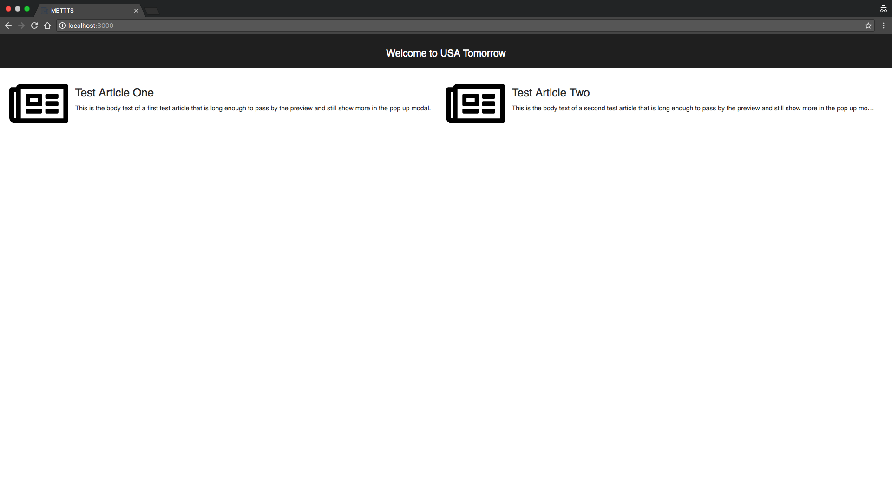
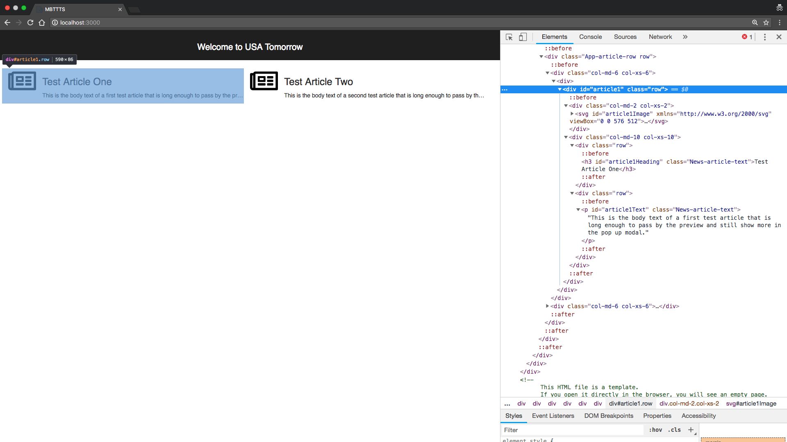
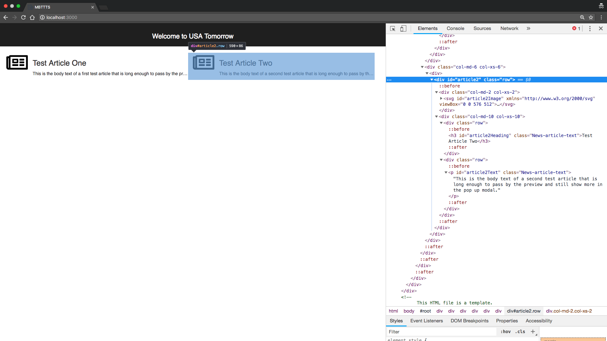

Following through the tutorial we should now have two components created, our entry component 'NavigateToTestSite' and our 'MainSiteLayout' component.  If we go back and take a look at the home page of the site, which 'MainSiteLayout' is modeling, we can see there is more than just the header we currently have modeled.



Besides the header, we can see two articles presented to us. Each article contains a picture of a newspaper, a title, and some article text.  For our tests we want to make sure these are both loaded correctly, in order to do that we need to create elements, and add them into a model. Since these articles are present on the 'MainSiteLayout', lets add them there.

First we will create the elements, for each article we care about 3 things, the picture, the title, and the article text. Since we have two articles we will be creating 6 new elements. Let's go to Chrome developer tools to find our Ids.





Looking at the id's in the HTML above we can see the corresponding id's for the first article `article1Image`, `article1Heading`, `article1Text` and `article2Image`, `article2Heading`, `article2Text` for the second article. Now we can create the elements inside `MainSiteLayout`.

```
'use strict'

module.exports = {
  type: 'MainSiteLayout',
  elements () {
    return [
      {
        name: 'siteHeader',
        selector: {
          type: 'getElementById',
          value: 'siteHeader'
        }
      },
      {
        name: 'article1Image',
        selector: {
          type: 'getElementById',
          value: 'article1Image'
        }
      },
      {
        name: 'article1Heading',
        selector: {
          type: 'getElementById',
          value: 'article1Heading'
        }
      },
      {
        name: 'article1Text',
        selector: {
          type: 'getElementById',
          value: 'article1Text'
        }
      },
      {
        name: 'article2Image',
        selector: {
          type: 'getElementById',
          value: 'article2Image'
        }
      },
      {
        name: 'article2Heading',
        selector: {
          type: 'getElementById',
          value: 'article2Heading'
        }
      },
      {
        name: 'article2Text',
        selector: {
          type: 'getElementById',
          value: 'article2Text'
        }
      },
    ];
  },
  model () {
    return {
      header: {
        displayed: 'siteHeader.isDisplayed'
      }
    };
  },
  actions () {
    return {};
  }
}
```

Now that we have our elements, we can add to the model section. Before we start adding to the model we need to decide what parts about each element we care about. For each article let's decide we care if the image is displayed, the heading is displayed and we verify the correct text, and that the article text is displayed and the correct text.

```
'use strict'

module.exports = {
  type: 'MainSiteLayout',
  elements () {
    return [
      {
        name: 'siteHeader',
        selector: {
          type: 'getElementById',
          value: 'siteHeader'
        }
      },
      {
        name: 'article1Image',
        selector: {
          type: 'getElementById',
          value: 'article1Image'
        }
      },
      {
        name: 'article1Heading',
        selector: {
          type: 'getElementById',
          value: 'article1Heading'
        }
      },
      {
        name: 'article1Text',
        selector: {
          type: 'getElementById',
          value: 'article1Text'
        }
      },
      {
        name: 'article2Image',
        selector: {
          type: 'getElementById',
          value: 'article2Image'
        }
      },
      {
        name: 'article2Heading',
        selector: {
          type: 'getElementById',
          value: 'article2Heading'
        }
      },
      {
        name: 'article2Text',
        selector: {
          type: 'getElementById',
          value: 'article2Text'
        }
      },
    ];
  },
  model () {
    return {
      header: {
        displayed: 'siteHeader.isDisplayed'
      },
      article1: {
        image: {
          displayed: 'article1Image.isDisplayed'
        },
        heading: {
          displayed: 'article1Heading.isDisplayed',
          text: 'article1Heading.innerText'
        },
        body: {
          displayed: 'article1Text.isDisplayed',
          text: 'article1Text.innerText'
        }
      },
      article2: {
        image: {
          displayed: 'article2Image.isDisplayed'
        },
        heading: {
          displayed: 'article2Heading.isDisplayed',
          text: 'article2Heading.innerText'
        },
        body: {
          displayed: 'article2Text.isDisplayed',
          text: 'article2Text.innerText'
        }
      }
    };
  },
  actions () {
    return {};
  }
}
```

When creating our model, we chose to group things together under objects to try and make clear groupings of the different aspects of `MainSiteLayout`. In addition we called the articles text section 'body', as accessing `article1.text.text` isn't as clear as `article1.body.text`.

Remember, when creating a model you get to control the structure of the model for what makes sense to you and your system.
{: .notice--info}

Now that we have updated the model for `MainSiteLayout` we need to make sure when we create and add this component to the state, we tell Simulato what we expect for each section of our newly revised model.  Let's go back to `NavigateToTestSite` where `MainSiteLayout` is added, and update the expected state.

```
'use strict'

module.exports = {
  type: 'NavigateToTestSite',
  entryComponent: {
    name: 'navigateToTestSite',
    state: {}
  },
  elements () {
    return [];
  },
  model () {
    return {};
  },
  actions () {
    return {
      NAVIGATE_TO_SITE: {
        perform (callback) {
          driver.get('http://localhost:3000')
            .then(callback, callback);
        },
        effects (expectedState) {
          expectedState.clear();
          expectedState.createAndAddComponent({
            type: 'MainSiteLayout',
            name: 'mainSiteLayout',
            state: {
              header: {
                displayed: true
              },
              article1: {
                image: {
                  displayed: true
                },
                heading: {
                  displayed: true,
                  text: 'Test Article One'
                },
                body: {
                  displayed: true,
                  text: 'This is the body text of a first test article that is long enough to pass by the preview and still show more in the pop up modal.'
                }
              },
              article2: {
                image: {
                  displayed: true
                },
                heading: {
                  displayed: true,
                  text: 'Test Article Two'
                },
                body: {
                  displayed: true,
                  text: 'This is the body text of a second test article that is long enough to pass by the preview and still show more in the pop up modal.'
                }
              }
            }
          });
        }
      }
    };
  },
}
```

Whenever a model changes for a given component, any other component that creates and adds that component to the expected state must be updated. If Simulato doesn't have an expected value for any given part of the model, it will not match the value it gets from the page state, and the test will fail.
{: .notice--warning}

Now that our components are updated we should be able to generate and run the tests.  Be sure to clear our your previous test from the test folder so it doesnt run any old tests unexpectedly.

`$ simulato generate -o ./tests`

As before, it should still only generate one test, in fact it should generate the exact same test. Since we have not created any new actions, it will be the same test. However during execution there are more things on the page it will be checking for, our newly added articles, to validate that we navigated to the site correctly.

`$ simulato run -T ./tests`

Once again the single test should pass.  However let's take this time to purposely make some breaking changes so we can learn some common Simulato debugging tips, and possibly help if your test is not passing.  As in the previous section of the tutorial, lets change part of our expected state when create and add `MainSiteLayout`.  I am going to change the article 2 body to say I expect it NOT to be displayed, and I am going to change the article 1 header text to 'Test Article Three'.

```
expectedState.createAndAddComponent({
  type: 'MainSiteLayout',
  name: 'mainSiteLayout',
  state: {
    header: {
      displayed: true
    },
    article1: {
      image: {
        displayed: true
      },
      heading: {
        displayed: true,
        text: 'Test Article Three'
      },
      body: {
        displayed: true,
        text: 'This is the body text of a first test article that is long enough to pass by the preview and still show more in the pop up modal.'
      }
    },
    article2: {
      image: {
        displayed: true
      },
      heading: {
        displayed: true,
        text: 'Test Article Two'
      },
      body: {
        displayed: false,
        text: 'This is the body text of a second test article that is long enough to pass by the preview and still show more in the pop up modal.'
      }
    }
  }
});
```

Now let's rerun our test and see what happens.

```
$ simulato run -T ./tests
❌ 1533583159691-simulato-1_1.json 🍅

ActionError EXPECTED_STATE_ERROR: Page state did not equal expected state
  //ERROR STACK TRACE

Action: navigateToTestSite.NAVIGATE_TO_SITE
Step: effects
ActionIndex: 0

-- Page State
++ Expected State
  {
    mainSiteLayout: {
      article1: {
        heading: {
-         text: 'Test Article One',
+         text: 'Test Article Three',
        },
      },
      article2: {
        body: {
-         displayed: true,
+         displayed: false,
        },
      },
    },
  }


*** Final Aggregate Test Summary ***
Total tests run: 1
Tests passed: 0
Tests failed: 1
Run time: 11.833410887 seconds

Failed Tests:

1533583159691-simulato-1_1.json - Ran 1 time(s)
        Run 1: ActionError EXPECTED_STATE_ERROR: Page state did not equal expected state
                Action: navigateToTestSite.NAVIGATE_TO_SITE Step: effects ActionIndex: 0
```

Once again this is showing us the effects failed, and what part of the expected state did not match the actual page state.

**Note:** It will only show the parts of the state that are different. Parts of the expected state and page state that assert correctly will not be shown.
{: .notice--info}

Now let's remove article2 altogether from our expected state.

```
expectedState.createAndAddComponent({
  type: 'MainSiteLayout',
  name: 'mainSiteLayout',
  state: {
    header: {
      displayed: true
    },
    article1: {
      image: {
        displayed: true
      },
      heading: {
        displayed: true,
        text: 'Test Article Three'
      },
      body: {
        displayed: true,
        text: 'This is the body text of a first test article that is long enough to pass by the preview and still show more in the pop up modal.'
      }
    }
  }
});
```

Now we run the test to see what happens.

```
$ simulato run -T ./tests
❌ 1533583159691-simulato-1_1.json 🍅

ActionError EXPECTED_STATE_ERROR: Page state did not equal expected state
    //ERROR STACK TRACE

Action: navigateToTestSite.NAVIGATE_TO_SITE
Step: effects
ActionIndex: 0

-- Page State
++ Expected State
  {
    mainSiteLayout: {
      article1: {
        heading: {
-         text: 'Test Article One',
+         text: 'Test Article Three',
        },
      },
-     article2: {
-       image:: {
-         displayed: true,
-       },
-       heading:: {
-         displayed: true,
-         text: 'Test Article Two',
-       },
-       body:: {
-         displayed: true,
-         text: 'This is the body text of a second test article that is long enough to pass by the preview and still show more in the pop up modal.',
-       },
-     },
+     article2: undefined,
    },
  }


*** Final Aggregate Test Summary ***
Total tests run: 1
Tests passed: 0
Tests failed: 1
Run time: 11.877945349 seconds

Failed Tests:

1533583159691-simulato-1_1.json - Ran 1 time(s)
        Run 1: ActionError EXPECTED_STATE_ERROR: Page state did not equal expected state
                Action: navigateToTestSite.NAVIGATE_TO_SITE Step: effects ActionIndex: 0

TYS-ITS-135884:simulato-tutorial tdale$
```

As seen above it is still showing us the same effects error for article 1, that we expected a different heading text than was on the page.  Article two shows another common mistake when creating components. It shows us the entire page state of article 2, and our expected state is simply 'undefined'. This helps point us towards the fact that we forgot to put article2 in our expected state, essentially telling Simulato we expect it not to be there.  However, since it is present in the model of 'MainSiteLayout' it finds the page state, and our assertion fails.

**Note:** Whenever you see `undefined` inside the *expected state* check to make sure your expected `state` you are creating matches the structure of the model for the component you are adding.
{: .notice--info}

Let's make one more common error. First, to make the example more clear, let's go back to a passing state fixing all the current errors we have created.

```
expectedState.createAndAddComponent({
  type: 'MainSiteLayout',
  name: 'mainSiteLayout',
  state: {
    header: {
      displayed: true
    },
    article1: {
      image: {
        displayed: true
      },
      heading: {
        displayed: true,
        text: 'Test Article One'
      },
      body: {
        displayed: true,
        text: 'This is the body text of a first test article that is long enough to pass by the preview and still show more in the pop up modal.'
      }
    },
    article2: {
      image: {
        displayed: true
      },
      heading: {
        displayed: true,
        text: 'Test Article Two'
      },
      body: {
        displayed: true,
        text: 'This is the body text of a second test article that is long enough to pass by the preview and still show more in the pop up modal.'
      }
    }
  }
});
```


Now let's go to our 'MainSiteLayout' and change an elements selector to have the incorrect value, passing in an incorrect id.  In addition, lets change the model to have a typo, referring to the name of an element that wasn't created in the elements section.  For the element, we will change `siteHeader` to have a bad id, and change `article1.image` inside the model to reference a bad element.

```
'use strict'

module.exports = {
  type: 'MainSiteLayout',
  elements () {
    return [
      {
        name: 'siteHeader',
        selector: {
          type: 'getElementById',
          value: 'THIS_IS_NOT_A_GOOD_ID'
        }
      },
      {
        name: 'article1Image',
        selector: {
          type: 'getElementById',
          value: 'article1Image'
        }
      },
      {
        name: 'article1Heading',
        selector: {
          type: 'getElementById',
          value: 'article1Heading'
        }
      },
      {
        name: 'article1Text',
        selector: {
          type: 'getElementById',
          value: 'article1Text'
        }
      },
      {
        name: 'article2Image',
        selector: {
          type: 'getElementById',
          value: 'article2Image'
        }
      },
      {
        name: 'article2Heading',
        selector: {
          type: 'getElementById',
          value: 'article2Heading'
        }
      },
      {
        name: 'article2Text',
        selector: {
          type: 'getElementById',
          value: 'article2Text'
        }
      },
    ];
  },
  model () {
    return {
      header: {
        displayed: 'siteHeader.isDisplayed'
      },
      article1: {
        image: {
          displayed: 'THIS_IS_NOT_AN_ELEMENT_CREATED_ABOVE.isDisplayed'
        },
        heading: {
          displayed: 'article1Heading.isDisplayed',
          text: 'article1Heading.innerText'
        },
        body: {
          displayed: 'article1Text.isDisplayed',
          text: 'article1Text.innerText'
        }
      },
      article2: {
        image: {
          displayed: 'article2Image.isDisplayed'
        },
        heading: {
          displayed: 'article2Heading.isDisplayed',
          text: 'article2Heading.innerText'
        },
        body: {
          displayed: 'article2Text.isDisplayed',
          text: 'article2Text.innerText'
        }
      }
    };
  },
  actions () {
    return {};
  }
}
```

Now let's run the test and see what happens.

```
$ simulato run -T ./tests
❌ 1533583159691-simulato-1_1.json 🍅

ActionError EXPECTED_STATE_ERROR: Page state did not equal expected state
    //ERROR STACK TRACE

Action: navigateToTestSite.NAVIGATE_TO_SITE
Step: effects
ActionIndex: 0

-- Page State
++ Expected State
  {
    mainSiteLayout: {
      header: {
-      displayed: undefined,
+       displayed: true,
      },
      article1: {
        image: {
-         displayed: undefined,
+         displayed: true,
        },
      },
    },
  }


*** Final Aggregate Test Summary ***
Total tests run: 1
Tests passed: 0
Tests failed: 1
Run time: 11.917270323 seconds

Failed Tests:

1533583159691-simulato-1_1.json - Ran 1 time(s)
        Run 1: ActionError EXPECTED_STATE_ERROR: Page state did not equal expected state
                Action: navigateToTestSite.NAVIGATE_TO_SITE Step: effects ActionIndex: 0
```

Again we are seeing some `undefined` but this time its inside the page state rather than the expected state.

**Note:** Whenever you see `undefined` inside the *page state* check to make sure your selectors are correct, usually this means the element was not found. Also check your model, make sure everything is spelled correct, referencing the correct element as well as the correct property you are accessing.
{: .notice--info}

When looking at our newly modified `MainSiteLayout` we can see a lot of similarity with article one and two. The elements are all the same besides changes in id. The model is the same besides which article elements it references.  As programmers, whenever we see something like this we want to add a level of abstraction, only write out that code once, this is where reusable components come in.  [Part 2](/tutorial/reusable-components-pt2/) of reusable components will convert our articles into one reusable component.