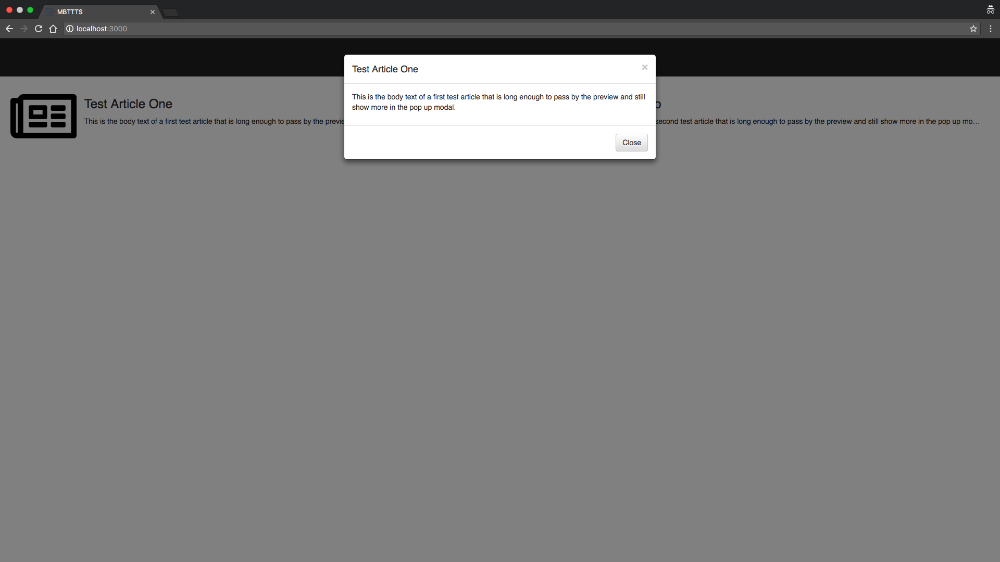

In the previous sections we covered creating our [first component](/tutorial/first-component/), [entry components](/tutorial/entry-component/), and making [reusable components](/tutorial/reusable-components-pt1). Throughout this process we still only have our one action, `NAVIGATE_TO_TEST_SITE`. We can now start adding new actions, to get a better test suite for our system.  Going back to our test site, if we click a news article, a pop up modal appears showing us the news article in full, we can start by adding that action first.



Both articles behave the same way, opening a model with their respective information. Since we created one reusable component,`NewsArticle`, we can a single action inside of that component to test the behavior of clicking a news article.  Since we gave each component of `type: NewsArticle` a unique name, Simulato will generate tests to click both `newsArticleOne` and `newsArticleTwo`.

During Simulato's planning step, it will generate tests to perform each action at least once. Unique actions are identified by the combination of the name of the component, and the action name.
{: .notice--info}

Let's construct an action, `CLICK_TO_VIEW_STORY`, for our `NewsArticle` component, starting with `preconditions`. Unlike our previous action `NAVIGATE_TO_TEST_SITE`, which had no `preconditions`, we know that to actually click the article one thing must be true, the article must be present on the page.  Examining the `model` we made for `NewsArticle`, we know we have access to `heading.displayed`, `text.displayed`, and `image.displayed`. Since we can click on any one of these individual elements to open the modal, we will just pick the `heading.displayed` as our precondition to opening the modal. Before we jump into the code, let's learn a bit on how to create `preconditions` inside Simulato.

The preconditions property of the action object must be a function that returns an array of arrays representing [chai asserts](http://www.chaijs.com/api/assert/).  Inside the simulato code, it will process the chai asserts to generate tests, as well as make sure conditions are met during test execution.  The chai assert array follows the exact same pattern regardless of what chai assert you are calling. The following pattern is used:

[ `<chaiAsserMethod>`, `<param1>`, `[param2]`, ... ]

For example, a commonly used chai asset is [isTrue](http://www.chaijs.com/api/assert/#method_istrue). Looking at the documentation, isTrue takes a param value, as well as an optional param message.  If we wanted to check something on the pageState is displayed we could make the following chai assert array:

[ 'isTrue', `pageState.${this.name}.displayed` ]

This would tell Simulato to call the chai assert isTrue method, passing in the value we care about to check if is true.

This particular example matches with exactly what we want to do.  For our action, we want to make sure the heading is displayed on the page before we click it. Let's jump into the code and create our `preconditions`.

```
'use strict'

/*****
* Options:
*  baseId *required*
*    String
*    Specifies the base id that will prepended to element selectors for image, heading, and text.
*****/

module.exports = {
  type: 'NewsArticle',
  elements () {
    return [
      {
        name: 'image',
        selector: {
          type: 'getElementById',
          value: `${this.options.baseId}Image`
        }
      },
      {
        name: 'heading',
        selector: {
          type: 'getElementById',
          value: `${this.options.baseId}Heading`
        }
      },
      {
        name: 'text',
        selector: {
          type: 'getElementById',
          value: `${this.options.baseId}Text`
        }
      }
    ];
  },
  model () {
    return {
      image: {
        displayed: 'image.isDisplayed',
      },
      heading: {
        displayed: 'heading.isDisplayed',
        text: 'heading.innerText'
      },
      body: {
        displayed: 'text.isDisplayed',
        text: 'text.innerText'
      }
    }
  },
  actions () {
    return {
      CLICK_TO_VIEW_STORY: {
        preconditions () {
          return [
            [ 'isTrue', `pageState.${this.name}.heading.displayed` ]
          ];
        }
      }
    };
  }
}
```

As seen above we are using `isTrue` as our assert, and we want to make sure that on the `pageState`, our current component's `heading` is `displayed`.  Whenever we add a component to the state, we provide a `type` and `name`. This means we are creating a component of a certain `type`, and giving it a unique `name`. We can use `this.name` as a way to always refer to the name of the component that is actually added into the state.  Basically, we are telling Simulato, go to the page state, find the component with the name `this.name`, which evaluates to the name given to it when it was added to the state. Once you have that instance of the component, go to its `heading.displayed` property inside the model, whose value will be populated by the actual page state, and assert that it equals true. 

During Simulato's planning step, it will not have access to the actual state of the page, it will only generate tests based on expected state. However, during execution, it will actually assert against the state of the page, to make sure preconditions are met.
{: notice--info}

Now that we have our `preconditions`, we can move on to the `perform`. Remember, our `perform` block is where we tell `Seleneium` how to interact with the page. For our action we simply want it to click the heading.

```
actions () {
  return {
    CLICK_TO_VIEW_STORY: {
      preconditions () {
        return [
          [ 'isTrue', `pageState.${this.name}.heading.displayed` ]
        ];
      },
      perform (callback) {
        driver.findElement(By.id(`${this.options.baseId}Heading`))
          .click()
          .then(callback, callback);
      }
    }
  };
}
```

Just like in our `elements` we can use `this.options` to created our dynamic id, and as always end our perform with `.then(callback, callback)`. 

Now, all that's left is creating the `effects` section of the action. Once we click the article, we need to describe the changes to our expected state.  At this point, we need add something to the expected state that we have not yet created a components for, our view story pop up modal.  Before we can finish our `CLICK_TO_VIEW_STORY` action, we need to go and create a new component.  Until most of your system is created this will be a common trend, creating new components when the effects of other actions need them. Just like our entry component `NavigateToTestSite` needed `MainSiteLayout` for its effects, `NewsArticle` will need a component we will call `ViewStoryModal`.

As always, start by creating a new file in our components folder, `viewStoryModal.model.js`. Just like before we need to investigate the dom, pulling ids to create our `elements` section. Similar to `NewsArticle`, we want to create `ViewStoryModal` with reusability in mind, since every `NewsArticle` component added to the state will have our action `CLICK_TO_VIEW_STORY`, we need to create `ViewStoryModal` in a way to work for everyone. For our elements and model, we will care about the modal title, the modal body, and the close button.

```
'use strict';

/*****
* Options:
*  baseId *required*
*    String
*    Specifies the base id that will prepended to element selectors for title, body, and closeButton.
*****/

module.exports = {
  type: 'ViewStoryModal',
  elements () {
    return [
      {
        name: 'title',
        selector: {
          type: 'getElementById',
          value: `${this.options.baseId}ModalTitle`
        }
      },
      {
        name: 'body',
        selector: {
          type: 'getElementById',
          value: `${this.options.baseId}ModalBodyText`
        }
      },
      {
        name: 'closeButton',
        selector: {
          type: 'getElementById',
          value: `${this.options.baseId}ModalCloseButton`
        }
      }
    ];
  },
  model () {
    return {
      title: {
        displayed: 'title.isDisplayed',
        text: 'title.innerText'
      },
      body: {
        displayed: 'body.isDisplayed',
        text: 'body.innerText'
      },
      closeButton: {
        displayed: 'closeButton.isDisplayed'
      }
    };
  },
  actions () {
    return {};
  }
};
```

Many actions inside a user interface create effects that cover up parts of a page, or make certain parts of the page inaccessible. When we create a pop up, or even just a drop dpwn menu, parts of the screen are usually covered up that were previously in the forefront.  As human users of the system, we know we can close the pop up, or close the drop down to access the hidden elements. When creating components, actions, and effects for Simulato, we need a way of replicating this, and telling Simulato to restrict its actions to a certain section of the screen.  During planning, when Simulato is determining test scripts, it looks for available actions based on the current expected state of the system. We can limit what actions Simulato generates to by limiting the expected state.  So in our current example, if we click the news article, we know a pop up appears. If we remove everything from the expected state, and just add the `ViewStoryModal` component to the expected state, Simulato will only look for actions in that limited expected state.  Thinking ahead a bit, we will want to add an action to `ViewStoryModal` that clicks the close button.  When we click the close button, we will want to return the previous expected state, that is, the exact state before we opened the modal.  As of right now we have only looked at `expectedState.clear()`, `expectedState.delete()`, and `expectedState.createAndAddComponent()`.  With our current toolkit, we would have to clear the expected state, add our new `ViewStoryModal` component. Then, once the close button is clicked, clear the expected state once more, and re-add everything from the previous state.  Since this is a somewhat common user interface experience, we want an easier way to return to previous states, and that's where `expectedState.stash()` and `expectedState.pop()` come in. The `expectedState.stash()` and `expectedState.pop()` functions will be used when we don't want to delete our state, but simply store it for later until we come back.

With `expectedState.stash()` and `expectedState.pop()`, along without new `ViewStoryModal` component we have everything we need to create the `effects` for `NewsArticle`'s action `CLICK_TO_VIEW_STORY`.  First we will stash our state, knowing that once we close the modal later we will want to go back to it. Then with our now empty expected state, we will add in our new `ViewStoryModal` component. There is one small complication, in that when we add `ViewStoryModal`, we need to add its expected `state`. When creating the state, We need to provide both the text value for the title, and the body.  We cannot hard code these values, as they will be dependent on each specific news article.  Since we need some sort of dynamic data passed in, our first thought should be how can we use `this.options` to pass the data we need.  Way back when we add `NewsArticle`s to the state, inside the effects of `NAVIGATE_TO_TEST_SITE`, we know the values for both the title and heading.  We need to pass both values, into the options, so we can use them later inside our `CLICK_TO_VIEW_STORY` effects.

```
'use strict'

module.exports = {
  type: 'NavigateToTestSite',
  entryComponent: {
    name: 'navigateToTestSite',
    state: {}
  },
  elements () {
    return [];
  },
  model () {
    return {};
  },
  actions () {
    return {
      NAVIGATE_TO_SITE: {
        perform (callback) {
          driver.get('http://localhost:3000')
            .then(callback, callback);
        },
        effects (expectedState) {
          expectedState.clear();
          expectedState.createAndAddComponent({
            type: 'MainSiteLayout',
            name: 'mainSiteLayout',
            state: {
              header: {
                displayed: true
              }
            }
          });
          const article1Heading = 'Test Article One';
          const article1Body = 'This is the body text of a first test article that is long enough to pass by the preview and still show more in the pop up modal.';
          expectedState.createAndAddComponent({
            type: 'NewsArticle',
            name: 'newsArticleOne',
            state: {
              image: {
                displayed: true
              },
              heading: {
                displayed: true,
                text: article1Heading
              },
              body: {
                displayed: true,
                text: article1Body
              }
            },
            options: {
              baseId: 'article1',
              headingText: article1Heading,
              bodyText: article1Body
            }
          });
          const article2Heading = 'Test Article Two';
          const article2Body = 'This is the body text of a second test article that is long enough to pass by the preview and still show more in the pop up modal.';
          expectedState.createAndAddComponent({
            type: 'NewsArticle',
            name: 'newsArticleTwo',
            state: {
              image: {
                displayed: true
              },
              heading: {
                displayed: true,
                text: article2Heading
              },
              body: {
                displayed: true,
                text: article2Body
              }
            },
            options: {
              baseId: 'article2',
              headingText: article2Heading,
              bodyText: article2Body
            }
          });
        }
      }
    };
  },
}
```

Now that we set up sending the information to `NewsArticle`, we need can create our effects for `CLICK_TO_VIEW_STORY`. Since we are passing in more information with options, we will update our internal documentation.

```
'use strict'

/*****
* Options:
*  baseId *required*
*    String
*    Specifies the base id that will prepended to element selectors for image, heading, and text.
* 
*  headingText *required*
*    String
*    Specifies the articles heading text, passed to the ViewStoryModal inside CLICK_TO_VIEW_STORY
*
*  bodyText *required*
*    String
*    Specifies the articles body text, passed to the ViewStoryModal inside CLICK_TO_VIEW_STORY
*****/

module.exports = {
  type: 'NewsArticle',
  elements () {
    return [
      {
        name: 'image',
        selector: {
          type: 'getElementById',
          value: `${this.options.baseId}Image`
        }
      },
      {
        name: 'heading',
        selector: {
          type: 'getElementById',
          value: `${this.options.baseId}Heading`
        }
      },
      {
        name: 'text',
        selector: {
          type: 'getElementById',
          value: `${this.options.baseId}Text`
        }
      }
    ];
  },
  model () {
    return {
      image: {
        displayed: 'image.isDisplayed',
      },
      heading: {
        displayed: 'heading.isDisplayed',
        text: 'heading.innerText'
      },
      body: {
        displayed: 'text.isDisplayed',
        text: 'text.innerText'
      }
    }
  },
  actions () {
    return {
      CLICK_TO_VIEW_STORY: {
        preconditions () {
          return [
            [ 'isTrue', `pageState.${this.name}.heading.displayed` ]
          ];
        },
        perform (callback) {
          driver.findElement(By.id(`${this.options.baseId}Heading`))
            .click()
            .then(callback, callback);
        },
        effects (expectedState) {
          expectedState.stash();
          expectedState.createAndAddComponent({
            type: 'ViewStoryModal',
            name: `${this.name}ViewStoryModal`,
            state: {
              title: {
                displayed: true,
                text: this.options.headingText
              },
              body: {
                displayed: true,
                text: this.options.bodyText
              },
              closeButton: {
                displayed: true
              }
            },
            options: {
              baseId: this.options.baseId
            }
          });
        }
      }
    };
  }
}
```

Now that we are dynamically creating `ViewStoryModal` for any `NewsArticle` component, we can finish by adding our `CLOSE_MODAL` action to `ViewStoryModal`, which simply calls `expectedState.pop()`.

```
'use strict';

/*****
* Options:
*  baseId *required*
*    String
*    Specifies the base id that will prepended to element selectors for title, body, and closeButton.
*****/

module.exports = {
  type: 'ViewStoryModal',
  elements () {
    return [
      {
        name: 'title',
        selector: {
          type: 'getElementById',
          value: `${this.options.baseId}ModalTitle`
        }
      },
      {
        name: 'body',
        selector: {
          type: 'getElementById',
          value: `${this.options.baseId}ModalBodyText`
        }
      },
      {
        name: 'closeButton',
        selector: {
          type: 'getElementById',
          value: `${this.options.baseId}ModalCloseButton`
        }
      }
    ];
  },
  model () {
    return {
      title: {
        displayed: 'title.isDisplayed',
        text: 'title.innerText'
      },
      body: {
        displayed: 'body.isDisplayed',
        text: 'body.innerText'
      },
      closeButton: {
        displayed: 'closeButton.isDisplayed'
      }
    };
  },
  actions () {
    return {
      CLOSE_MODAL: {
        preconditions () {
          return [
            [ 'isTrue', `pageState.${this.name}.closeButton.displayed` ]
          ];
        },
        perform (callback) {
          driver.findElement(By.id(`${this.options.baseId}ModalCloseButton`))
            .click()
            .then(callback, callback);
        },
        effects (expectedState) {
          expectedState.pop();
        }
      }
    };
  }
};
```

At this point we have successfully added new actions that uses stash and pop. Because there are 2 news articles, each with their own modal, we actually added 4 new actions to our test suite. We can now navigate to the site, as well as open and close both news articles modals. let's generate our tests and see what it says.

`$ npm run generate-tests`

You should see the following output: 

```
Generated and wrote 2 test(s) to disk

-- Action Coverage Report --

Action Occurrences
        navigateToTestSite.NAVIGATE_TO_SITE: 2
        newsArticleOne.CLICK_TO_VIEW_STORY: 1
        newsArticleTwo.CLICK_TO_VIEW_STORY: 1
        newsArticleOneViewStoryModal.CLOSE_MODAL: 1
        newsArticleTwoViewStoryModal.CLOSE_MODAL: 1

Action Coverage: 5 / 5

Action Coverage Percentage: 100.00%
```

Note, that because we used `this.name` when creating the `ViewStoryModal` components, the names are clearly grouped. This allows us to easily identify which `CLOSE_MODAL` action belongs to which article.

Now let's run our new tests.

`$ npm run test`

Two tests were created, so both tests will spin up a browser and run locally at the same time. By default, 20 tests will run in parallel at once. The setting `parallelism` is one of the cli/config options that can be changed to scale tests up or down depending on your machine's performacnce.

With the completion of this section, we have gone over most of the basics for using Simulato that will allow you to test a UI.